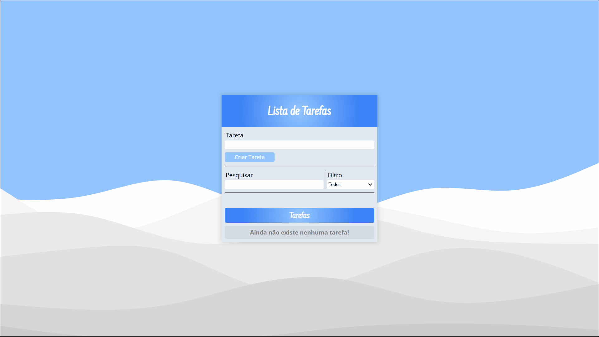

# Lista de Tarefas

### [Visitar Projeto](#)

---

## 📝 Sobre
Projeto de um **Lista de Tarefas** onde pode ser adicionado anotações que podem ser editados, removidos ou marcados como concluído. Todos as tarefas ficam salva no **LocalStorage**, possibilitando a não perde dessas tarefas quando o navegador for fechado. Também foi criado uma barra de pesquisa onde pode ser usado para procurar anotações especificas, e também um filtro que possibilita a exibição apenas das tarefas que estão em aberto ou concluído.

## 🛠️ Tecnologias
Projeto desenvolvido utilizando as seguintes tecnologias:
- HTML
- CSS
- JavaScript

---

Projeto desenvolvido por [Luiz Teles](#)